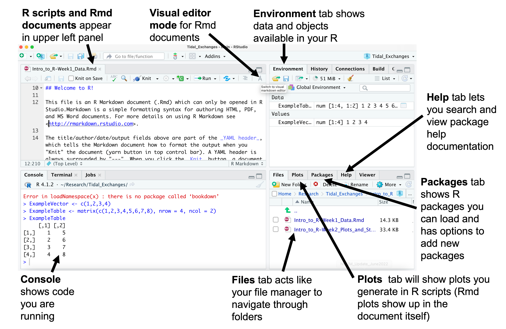
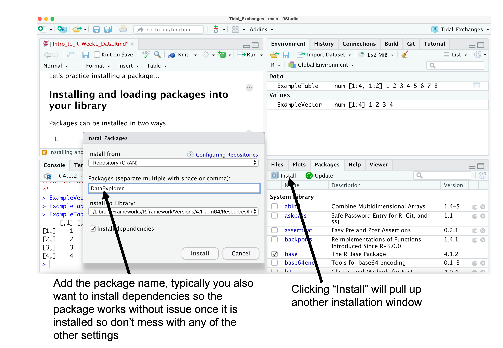
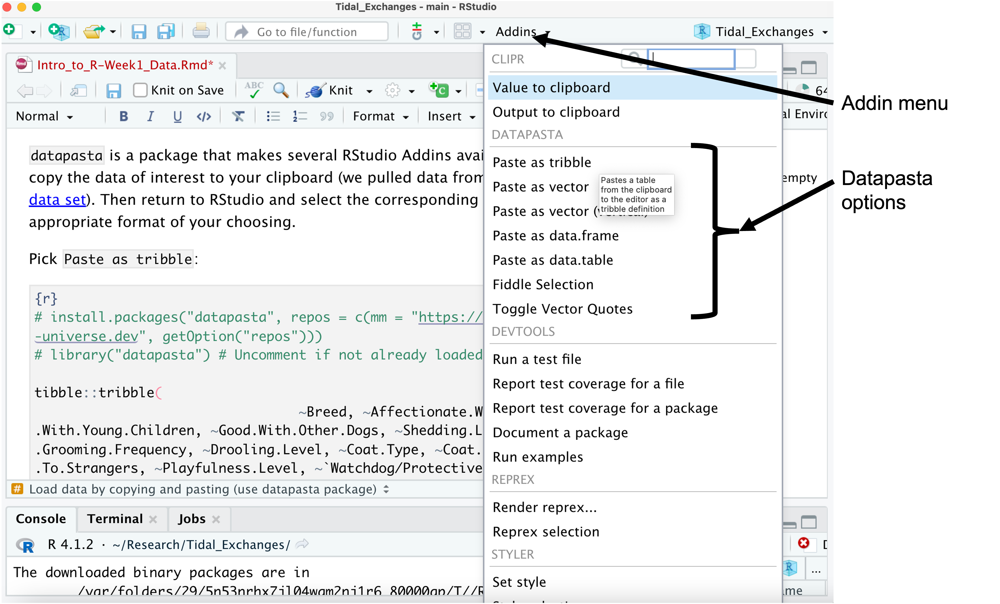
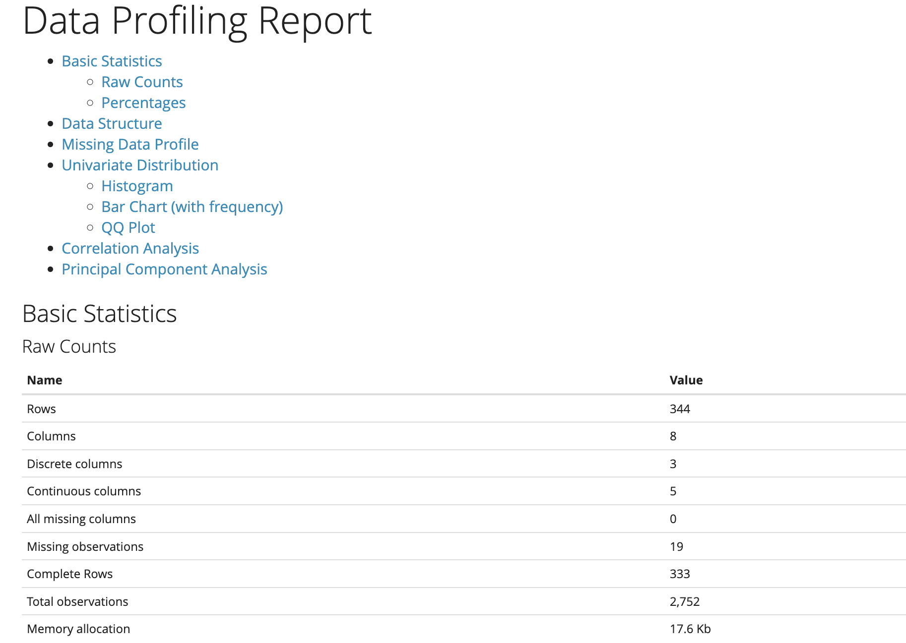

## Welcome to R & RStudio!

RStudio is the user interface for R and will look a bit like the following when you first get started:



There are two types of files that we typically open using RStudio:

1.  R scripts end with a ".R" extension and contain exclusively code, hashtags can be inserted to denote text comments that shouldn't be executed as code. Plots generated by the R script will appear in the plots tab in the bottom right of the RStudio interface.

2.  RMarkdown files end with ".Rmd" extensions and can include a mix of text, code chunks, and plots. RMarkdown files can only be opened in R Studio.Markdown and have simple formatting syntax for authoring HTML, PDF, and MS Word documents. For more details on using R Markdown see <http://rmarkdown.rstudio.com>.

All RMarkdown documents will have a YAML header, which tells Markdown how to format the output when you "Knit" the document (yarn button in top control bar) to the final format and contains information on the title, author, date, and output type at the top of the file. When you click the *Knit* button, a document will be generated that includes both written content as well as the output of any embedded R code chunks within the document. All other information in the file can be edited in one of two ways: 1) edit in the source editor (default view) or 2) switch to the visual editor mode (compass icon in upper right of RMarkdown panel) to edit more like a typical text editor.

1.  Use source editor view

    -   You can treat the *white space* in this document almost like a Word document. Use it to add metadata or document your process.

    -   You can use html codes to format the text in the white space. For example, you can *italicize* or **bold** regular text, add [hyperlinks](https://wordpress.com/support/markdown-quick-reference/) and create various level headers:

        -   <div>

            # Header 1

            </div>

        -   <div>

            ## Header 2

            </div>

        -   <div>

            ### Header 3

            </div>

        -   <div>

            #### Header 4

            </div>

        -   <div>

            ##### Header 5

            </div>

        -   <div>

            ###### Header 6

            </div>

    -   You can also create bulleted or numbered lists:

        1.  Item

        2.  Item

            -   Sub-item

            -   Sub-item

        3.  Item

    -   The *gray* areas are called "embedded code chunks." You can add a code chunk using the green + "Insert" button on the top control bar, or by typing three backticks (\`). You must also close to chunk with three backticks to run the chunk. The "r" in {brackets} at the top of the code chunks tells R Studio that you're writing in the R programming language (you can also write in other languages, but we won't worry about that for now).

    -   You can run the chunk by highlighting the code and pressing the "Run" button on the top control bar. You can also press the green arrow at the far right of the code chunk to run it.

    -   The code will run in the console (bottom left panel) and the code's output will be displayed inline or embedded in the active script (top left panel... and probably where you're reading this).

    -   Objects created by the code will be saved into the Environment (top right panel).

    -   The bottom right panel has a few useful functionalities including allowing you to install packages (non-programmatically) and view which packages you already have installed (Packages Tab), search the help menu/documentation (Help Tab), and view plots you created in the code (Viewer Tab).

    -   Base R has >2000 pre-loaded functions, so without doing anything else, you can actually do a lot in R! But there are thousands of packages that can also be installed and use in R, which gives you endless possibilities to explore.

2.  Use visual editor view

    -   Use control panel to format document as you would a word document or GoogleDoc

    -   Code chunks can be added via the "Insert" button and will be displayed in the same way as the source editor once the document has been knitted to its final format.

## What is a function?

Functions are "self contained" modules of code that accomplish a specific task. Functions usually take in some sort of data structure (value, vector, dataframe etc.), process it, and return a result. Functions are often called either from base R or a package you've loaded into your library. You can also write your own functions. We'll get to that later.

The general usage for a function is the name of the function followed by parentheses:

> `function_name(input)`

The input(s) are called arguments, which can include:

-   The data object (any data structure) on which the function carries out a task
-   Specifications that alter the way the function operates (e.g. options)

Some functions can be called without arguments provided, in which case default options are used. For example `getwd()` tells you what folder RStudio is working within and requires no argument to run:

```{r}
getwd()
```

Most functions can take several arguments. If you don't specify a required argument when calling the function, you will either receive an error (you are required to provide the argument) or the function will fall back on using a default setting.

The defaults represent standard values that the author of the function specified as being "good enough in standard cases". An example would be what symbol or color to use in a plot.

To get more information about a function and its arguments use the `help()` function to pull up documentation in the 'Help' tab (bottom right). The argument is any function from base R or a package you have installed.

```{r}
help(getwd)
```

All analysis in R uses functions, lets start by looking at a few that can help add new tools to R...

## Installing and loading packages into your library

Packages contain groups of related functions and come pre-installed (i.e. functions and packages that are part of base R) or can be installed in two ways:

1.  Use the 'Packages' tab and select the 'Install' option to install a specific package.



2.  Install using code:

```{r setup, eval = FALSE}
# You can also write documentation (non-code) in the code chunk, but you must # it out (will turn green when viewed in RStudio)

# This is the setup chunk (chunk names go after the language in the brackets)

knitr::opts_chunk$set(echo = TRUE)

# First, we will install 2 packages using code. You only need to do this step once. After tidyverse and DataExplorer are installed, you can delete this line of code or comment it out using # (will not be run)

install.packages("tidyverse")
install.packages("DataExplorer")
```

```{r}
# Second, you must load the installed packages into your library (working RStudio session) to be able to use it in the code. This must be done in each new R script or RMarkdown document you write.

library(tidyverse)
library(DataExplorer)
```

`tidyverse` is actually a collection of packages. The packages installed by tidyverse (tidyr, dplyr, readr, purrr, stringr, forcats, ggplot, and more!) contain the most useful (and most widely used) functions in R, outside of those functions which come as part of the base R package (you don't need to install this). We will cover many of these functions later on.

`DataExplorer` is a package that provides useful summaries for data exploration which we will use later on.

## Reading in data

How data is stored determines how we can read it into R for use in our analysis. Often public data sets are available through R packages or as Rdata (files with ".rds" extension), while our own data sets are saved as Excel or CSV files. For one-time analyses and quick testing it is sometimes possible to copy and paste data into R. Here we outline paths to load some of the more common data formats that we use, but know that R has lots of options to load other types of data (e.g. large data files are often pulled from a SQL databases and climate data is often stored as a NetCDF file).

-   Use the `<-` to assign something to an object that will be saved in your environment, this is equivalent to `=` in R but people get defensive about this so it is best to do what feels right for you and try not to debate it with others.

-   You will need to provide the full file path for CSV, Rdata, and Excel files whose data you want to load (e.g. "/Users/yourusername/folderwithdata/data.csv" instead of "data.csv"). The exception is when data you want to load is in your current working directory (i.e. the folder that RStudio is working in).

Before you start loading data check your current working directory using `getwd()`:

```{r}
getwd()
```

Use `setwd()` to change your working directory to the location where your data is stored:

```{r, eval=FALSE}
setwd("/Users/yourusername/folderwithdata")
```

### Load data by copying and pasting (use `datapasta` package)

`datapasta` is a package that makes several RStudio Addins available. To use, first copy the data of interest to your clipboard (we pulled data from [this TidyTuesday data set](https://github.com/rfordatascience/tidytuesday/blob/master/data/2022/2022-02-01/breed_traits.csv)). Then return to RStudio and select the corresponding Addin to paste in an appropriate format of your choosing. These addin paste options may also be [linked to keyboard shortcuts](https://support.rstudio.com/hc/en-us/articles/206382178-Customizing-Keyboard-Shortcuts).



Pick `Paste as tribble`:

```{r}
# install.packages("datapasta", repos = c(mm = "https://milesmcbain.r-universe.dev", getOption("repos"))) # Uncomment to install most up-to-date version of package
# library("datapasta") # Uncomment if not already loaded

tibble::tribble(
                                 ~Breed, ~Affectionate.With.Family, ~Good.With.Young.Children, ~Good.With.Other.Dogs, ~Shedding.Level, ~Coat.Grooming.Frequency, ~Drooling.Level, ~Coat.Type, ~Coat.Length, ~Openness.To.Strangers, ~Playfulness.Level, ~`Watchdog/Protective.Nature`, ~Adaptability.Level, ~Trainability.Level, ~Energy.Level, ~Barking.Level, ~Mental.Stimulation.Needs,
                "Retrievers (Labrador)",                        5L,                        5L,                    5L,              4L,                       2L,              2L,   "Double",      "Short",                     5L,                 5L,                            3L,                  5L,                  5L,            5L,             3L,                        4L,
                      "French Bulldogs",                        5L,                        5L,                    4L,              3L,                       1L,              3L,   "Smooth",      "Short",                     5L,                 5L,                            3L,                  5L,                  4L,            3L,             1L,                        3L,
                 "German Shepherd Dogs",                        5L,                        5L,                    3L,              4L,                       2L,              2L,   "Double",     "Medium",                     3L,                 4L,                            5L,                  5L,                  5L,            5L,             3L,                        5L,
                  "Retrievers (Golden)",                        5L,                        5L,                    5L,              4L,                       2L,              2L,   "Double",     "Medium",                     5L,                 4L,                            3L,                  5L,                  5L,            3L,             1L,                        4L,
                             "Bulldogs",                        4L,                        3L,                    3L,              3L,                       3L,              3L,   "Smooth",      "Short",                     4L,                 4L,                            3L,                  3L,                  4L,            3L,             2L,                        3L,
                              "Poodles",                        5L,                        5L,                    3L,              1L,                       4L,              1L,    "Curly",       "Long",                     5L,                 5L,                            5L,                  4L,                  5L,            4L,             4L,                        5L,
                              "Beagles",                        3L,                        5L,                    5L,              3L,                       2L,              1L,   "Smooth",      "Short",                     3L,                 4L,                            2L,                  4L,                  3L,            4L,             4L,                        4L,
                          "Rottweilers",                        5L,                        3L,                    3L,              3L,                       1L,              3L,   "Smooth",      "Short",                     3L,                 4L,                            5L,                  4L,                  5L,            3L,             1L,                        5L,
        "Pointers (German Shorthaired)",                        5L,                        5L,                    4L,              3L,                       2L,              2L,   "Smooth",      "Short",                     4L,                 4L,                            4L,                  4L,                  5L,            5L,             3L,                        5L,
                           "Dachshunds",                        5L,                        3L,                    4L,              2L,                       2L,              2L,   "Smooth",      "Short",                     4L,                 4L,                            4L,                  4L,                  4L,            3L,             5L,                        3L
        )
```

Pick `Paste as data.frame`:

```{r}
data.frame(
              stringsAsFactors = FALSE,
                   check.names = FALSE,
                         Breed = c("Retrievers (Labrador)","French Bulldogs",
                                   "German Shepherd Dogs","Retrievers (Golden)",
                                   "Bulldogs","Poodles","Beagles","Rottweilers",
                                   "Pointers (German Shorthaired)","Dachshunds"),
      Affectionate.With.Family = c(5L, 5L, 5L, 5L, 4L, 5L, 3L, 5L, 5L, 5L),
      Good.With.Young.Children = c(5L, 5L, 5L, 5L, 3L, 5L, 5L, 3L, 5L, 3L),
          Good.With.Other.Dogs = c(5L, 4L, 3L, 5L, 3L, 3L, 5L, 3L, 4L, 4L),
                Shedding.Level = c(4L, 3L, 4L, 4L, 3L, 1L, 3L, 3L, 3L, 2L),
       Coat.Grooming.Frequency = c(2L, 1L, 2L, 2L, 3L, 4L, 2L, 1L, 2L, 2L),
                Drooling.Level = c(2L, 3L, 2L, 2L, 3L, 1L, 1L, 3L, 2L, 2L),
                     Coat.Type = c("Double","Smooth","Double","Double","Smooth",
                                   "Curly","Smooth","Smooth","Smooth","Smooth"),
                   Coat.Length = c("Short",
                                   "Short","Medium","Medium","Short",
                                   "Long","Short","Short","Short","Short"),
         Openness.To.Strangers = c(5L, 5L, 3L, 5L, 4L, 5L, 3L, 3L, 4L, 4L),
             Playfulness.Level = c(5L, 5L, 4L, 4L, 4L, 5L, 4L, 4L, 4L, 4L),
  `Watchdog/Protective.Nature` = c(3L, 3L, 5L, 3L, 3L, 5L, 2L, 5L, 4L, 4L),
            Adaptability.Level = c(5L, 5L, 5L, 5L, 3L, 4L, 4L, 4L, 4L, 4L),
            Trainability.Level = c(5L, 4L, 5L, 5L, 4L, 5L, 3L, 5L, 5L, 4L),
                  Energy.Level = c(5L, 3L, 5L, 3L, 3L, 4L, 4L, 3L, 5L, 3L),
                 Barking.Level = c(3L, 1L, 3L, 1L, 2L, 4L, 4L, 1L, 3L, 5L),
      Mental.Stimulation.Needs = c(4L, 3L, 5L, 4L, 3L, 5L, 4L, 5L, 5L, 3L)
)
```

Pick `Paste as data.table` :

```{r}
data.table::data.table(
                   check.names = FALSE,
                         Breed = c("Retrievers (Labrador)","French Bulldogs",
                                   "German Shepherd Dogs","Retrievers (Golden)",
                                   "Bulldogs","Poodles","Beagles","Rottweilers",
                                   "Pointers (German Shorthaired)","Dachshunds"),
      Affectionate.With.Family = c(5L, 5L, 5L, 5L, 4L, 5L, 3L, 5L, 5L, 5L),
      Good.With.Young.Children = c(5L, 5L, 5L, 5L, 3L, 5L, 5L, 3L, 5L, 3L),
          Good.With.Other.Dogs = c(5L, 4L, 3L, 5L, 3L, 3L, 5L, 3L, 4L, 4L),
                Shedding.Level = c(4L, 3L, 4L, 4L, 3L, 1L, 3L, 3L, 3L, 2L),
       Coat.Grooming.Frequency = c(2L, 1L, 2L, 2L, 3L, 4L, 2L, 1L, 2L, 2L),
                Drooling.Level = c(2L, 3L, 2L, 2L, 3L, 1L, 1L, 3L, 2L, 2L),
                     Coat.Type = c("Double","Smooth","Double","Double","Smooth",
                                   "Curly","Smooth","Smooth","Smooth","Smooth"),
                   Coat.Length = c("Short",
                                   "Short","Medium","Medium","Short",
                                   "Long","Short","Short","Short","Short"),
         Openness.To.Strangers = c(5L, 5L, 3L, 5L, 4L, 5L, 3L, 3L, 4L, 4L),
             Playfulness.Level = c(5L, 5L, 4L, 4L, 4L, 5L, 4L, 4L, 4L, 4L),
  `Watchdog/Protective.Nature` = c(3L, 3L, 5L, 3L, 3L, 5L, 2L, 5L, 4L, 4L),
            Adaptability.Level = c(5L, 5L, 5L, 5L, 3L, 4L, 4L, 4L, 4L, 4L),
            Trainability.Level = c(5L, 4L, 5L, 5L, 4L, 5L, 3L, 5L, 5L, 4L),
                  Energy.Level = c(5L, 3L, 5L, 3L, 3L, 4L, 4L, 3L, 5L, 3L),
                 Barking.Level = c(3L, 1L, 3L, 1L, 2L, 4L, 4L, 1L, 3L, 5L),
      Mental.Stimulation.Needs = c(4L, 3L, 5L, 4L, 3L, 5L, 4L, 5L, 5L, 3L)
)
```

### Load data from a CSV (.csv) file

```{r}
# library(readr) # If the readr package is not loaded, uncomment and run this line of code
penguinsCSV <- read_csv(here::here("Intro_to_R", "Data/penguins_data.csv"))
```

The text below the code gives you information about what happened when you ran the code. Sometimes you'll get an error or warning message, but in this case, the output is telling you what variable types it assigned to each column.

Now that you've run this code chunk, you'll be able to see "penguinsCSV" in your environment (top right). Let's see what the data looks like inline.

```{r}
# To look at the entire dataset, just rerun the "penguins" object or type it into the console and hit enter. You may also double click the data object in the 'Environment' tab
penguinsCSV
```

R Markdown gives you a preview of the dataset and allows you to look through the whole dataset using the 'Next' button at the bottom of the table. Markdown also shows you what type of data is contained in each column below the column name (i.e., <chr> or <dbl>).

### Load data from an Excel (.xls or .xlsx) file

```{r}
# install.package("readxl")
# library("readxl") # Uncomment if package not already loaded

sheet1 <- readxl::read_excel(here::here("Intro_to_R/Data/testExcel.xlsx"), sheet = 1) # Pick sheet by number order
sheet1

sheet2 <- readxl::read_excel(here::here("Intro_to_R/Data/testExcel.xlsx"), sheet = "Is-it-a-fish") # Pick sheet by name
sheet2
```

### Load data from an RData (.rds) file

```{r}
practice <- readRDS(file = here::here("Intro_to_R/Data/testRData.rds"))
practice # Print the data you loaded to screen
```

### Load data from an R package

Typically all you need to do to load data from an R package is to load the package and call the named data set.

```{r}
# Load the palmerpenguins package
library(palmerpenguins)
# Take a look at the data set from this R package
penguins
# palmerpenguins::penguins is equivalent to the above line of code but explicitly lists the package the data is coming from.
```

## Types of objects in R

### Scalars

Scalars hold a single element or atomic value -- numeric, character, etc

\*Note: Character elements must be enclosed by quotation mark: either " or '

```{r}
my_col<-'red'
my_num<-13

my_col; my_num
```

```{r}
class(my_col)
class(my_num)
```

### Vectors

Vectors hold multiple elements all of the same class (can't mix numbers and character values in same vector)

```{r}
year_vec<-c(1968, 1981, 1996)
org_vec<-c('GMRI', 'NMFS', 'DFO')

year_vec;org_vec
```

Vectorized operations work on numeric vectors (i.e., you can do math on vectors)

```{r}
year_vec+1
```

### Dataframes/tibbles

2-dimensional data storage type, similar to an Excel spreadsheet

Different columns (which are each vectors) can have different classes

To create a dataframe or tibble, you can use the function data.frame() or tibble() where the arguments are the column names = a vector. You can either refer to a previously created vector (i.e., org_vec) below, or create on within the function using c().

```{r}
my_df<-data.frame(Org = org_vec, Year = c(2000,2000,2000))
my_df
```

*Note:* There are other types of objects you can create in R such as matrices, lists, and arrays, but for now, you can get away with using mostly vectors and dataframes.

## Exploratory data analysis

### Getting started

Most data exploration tries to answer the following questions:

-   What type of data do you have (i.e. in what format is it stored)?

-   Are there missing values or unusual features that may cause problems with your analysis?

-   Do you need to restructure your data or do preliminary calculations before you can start your analysis?

Here are a few functions to help you take a first look at your data quickly:

`DataExplorer::create_report()` is a function that will automatically generate an html report that summarizes the input data using plots and tables. [Full tutorial available here.](https://cran.r-project.org/web/packages/DataExplorer/vignettes/dataexplorer-intro.html)



```{r, results='hide'}
# install.package("DataExplorer")
# library(DataExplorer) # Uncomment if package isn't loaded in R
DataExplorer::create_report(penguins)
```

`summary()` is a function that will automatically count the number of occurrences for qualitative data and will provide the range, median, mean and innerquartile range for quantitative data.

```{r}
summary(penguins)
```

`head()` and `tail()` are functions that will respectively show you the first and last 6 rows of a table. A larger or smaller number of rows can be displayed by specifying the argument `n=#rows to display` .

```{r}
head(penguins) # default number of rows at top of table
tail(penguins, n=2) # Display only last 2 rows of a table

```

`dim()` Will tell you the dimensions of a table (matrix, data.table, data.frame, tibble, ect.), `nrow()` will return the number of rows, `ncol()` will return the number of columns, and `length()` will provide the length (number of data points) in a vector or list.

```{r}
dim(penguins)

nrow(penguins)

ncol(penguins)

length(penguins) # Tibbles are also lists so here the return from length() is the same as ncol()
```

`names()` will return the names of data points in a vector or list, while `colnames()` and `rownames()` return the column and row names respectively for tables.

```{r}
names(penguins)
colnames(penguins) # Same return as names() because tibbles are lists
rownames(penguins) # Returns a vector of numbers because row names are just an index for this data set
```

`class()` is a function that allows you to see what type of object something is. In this case, penguins is a "tibble" or "data frame" (same thing).

```{r}
class(penguins)
```

What is the argument (or input) for class()?

We used "penguins" here, but you could use any object in your R environment.

`str()` is a function that allows you to look at the structure of a dataframe (or other type of data object in R). It's always a good idea to use str() to get an idea of what types of values are included in your data.

```{r}
str(penguins)
```

Notice that some of the categorical variables in our penguins data set are listed as factors (e.g. 'species: Factor w/ 3 levels "Adelie", "Chinstrap",..: 1111111111...'). The factor levels have 2 pieces: the string (penguin names) that shows up in the tibble, and an integer that corresponds with this label that R can use in subsequent analysis of the categorical variable. The factor suggests that the first 10 rows should all have "Adelie" listed as the species, and if we look at the tibble this is indeed the case.

```{r}
head(penguins, n=10)
```

### Indexing

An important aspect of working with R objects is knowing how to "index" them. Indexing means selecting a subset of the data elements in order to use them in further analysis or possibly change them. Here we focus just on three kinds of vector indexing: positional, named reference, and logical Any of these indexing techniques works the same for all classes of vectors

Here are the most common types of index you'll use:

-   `[n]`: Use brackets to pick the nth item in a data object

    -   For vectors provide a single number `[n]` or name of the item

    -   For tibbles, dataframes, and matrices provide a row and column numbers or names `[nrow, ncol]`

-   `$`: access columns of a dataframe, or items in a list using `$` notation

Use brackets to index a vector or dataframe

```{r}
# access value 2 in a vector
year_vec[2]

# access the value in row 1, column 1 of a dataframe
my_df[1,1]

```

Rows using brackets

```{r}
# access row 1 in a dataframe (number goes after the comma)
my_df[1,]

```

Columns using brackets:

```{r}
# access column 1 in a dataframe (number goes after the comma)
my_df[,1]
# Or index column by name
my_df[,"Org"] 
```

You can also access columns by name rather than number by using the dollar sign indexing. If you type a dataframe's name followed by a \$, R will suggest the column names. Because rows aren't named, you can do the same thing for them.

```{r}
my_df$Org

```

You may want to use indexing to create new objects (vector in this case). For example:

```{r}
bill_lengths<-penguins$bill_length_mm

class(bill_lengths)
head(bill_lengths,20)
```

`head` is a new function that returns the first "n" values in an object. The primary argument is any R object. The default for n=6, but here I specified 20.

### Intro to the tidyverse

For this section, we will begin using functions from the tidyverse packages. To connect these functions, we will use an operator called the pipe that looks like this `%>%`

This operator will forward a value, or the result of an expression, into the next function call/expression. For instance a function to check the structure of data can be written as:

```{r}
str(my_df) 

#or

my_df %>% str()
```

Lets just remind ourselves what the penguins dataset looks like:

```{r}
penguins
```

### Data wrangling

`filter()` - Often we want to work with particular parts of data sets. The `filter` function from package `dplyr` allows us to filter (or subset) based on a specific set of criteria

```{r}
# filter by an exact condition, in this case, keep only species == "Gentoo"    *this is more often used for categorical variables but can be used on numeric variables as well (for example bill_length_mm == 46.1)

penguins %>% filter(species == "Gentoo")

```

\*Note, you can also write the function this way:

`filter(penguins,species == "Gentoo")`

But the pipe operator becomes useful when running multiple functions in a row

```{r}
# filter by value (can be greater than, lesser than, or equal to)

penguins %>% filter(body_mass_g > 5000)
```

```{r}
# filter to remove by an exact condition, in this case, island != "Torgersen" Which means remove any penguins caught on Torgersen island, but keep all others

penguins %>% filter(island != "Torgersen")
```

```{r}
# filter out NA values (works for both characters and numbers)

penguins %>% filter(!is.na(sex))
```

`mutate()` - adds new variables and preserves existing ones (unless you overwrite their name)

```{r}
# Perhaps we want to flipper length (in mm) to cm, we could add a new column to do this while doing math on the old column

penguins %>% mutate(flipper_length_cm = flipper_length_mm*0.1)
```

### Calculating summary statistics

`group_by()` - group by one or more variables

`summarize()` - reduce multiple values down to a single value

Calculate the mean bill length by species

```{r}
penguins %>% 
  group_by(species) %>% 
  summarise(mean_bill_length = mean(bill_length_mm, na.rm = T))
```

Calculate the mean and standard deviation of body mass by sex

```{r}
penguins %>% 
  group_by(sex) %>% 
  summarise(mean_mass = mean(body_mass_g, na.rm = T), 
            sd_mass = sd(body_mass_g, na.rm = T))
```

## Other functions to know

Let's look at a few common base functions.

`c()` is a function that combines values into a vector or list. We will use it here to create a numeric vector and test out some other functions

Again, use the \<- symbols to assign a name to some object you're creating. Oftentimes, you'll use functions to create a new object.

```{r}
my_vector <- c(5,2,8,1,9,5)
```

Now, let's run some basic mathematical functions since we have a numeric vector.

-   `mean()` - calculates mean (average) of a vector

-   `max()` - calculates maximum value of a vector

-   `sum()` - calculates sum of all values in a vector

-   `sort()` - sorts values in a vector numerically

```{r}
mean(my_vector)
max(my_vector)
sum(my_vector)
sort(my_vector)
```

Do you agree with the outputs?

## Specifying additional arguments or options within functions

Sometimes functions have additional arguments that change their behavior. If you don't specify additional arguments or options, R will use the default settings.

For the `sort` function we just learned, there are actually two arguments. Let's see what they are by opening the documentation using help().

```{r}
help(sort)
```

Now we know that in addition to the vector, sort also includes an argument called "decreasing" for which the default setting is "FALSE". Thus, items are sorted in ascending order by default. If we want to sort in decreasing order, we can set this argument to "TRUE".

```{r}
sort(my_vector, decreasing = TRUE)
```

You don't have to specify the argument name (i.e., x= or decreasing=), so long as you put the arguments in the correct order. For example, this function works just as well

```{r}
sort(my_vector, TRUE)
```

## Next week:

-   More data wrangling

-   Statistical tests & models

-   Plots & maps
