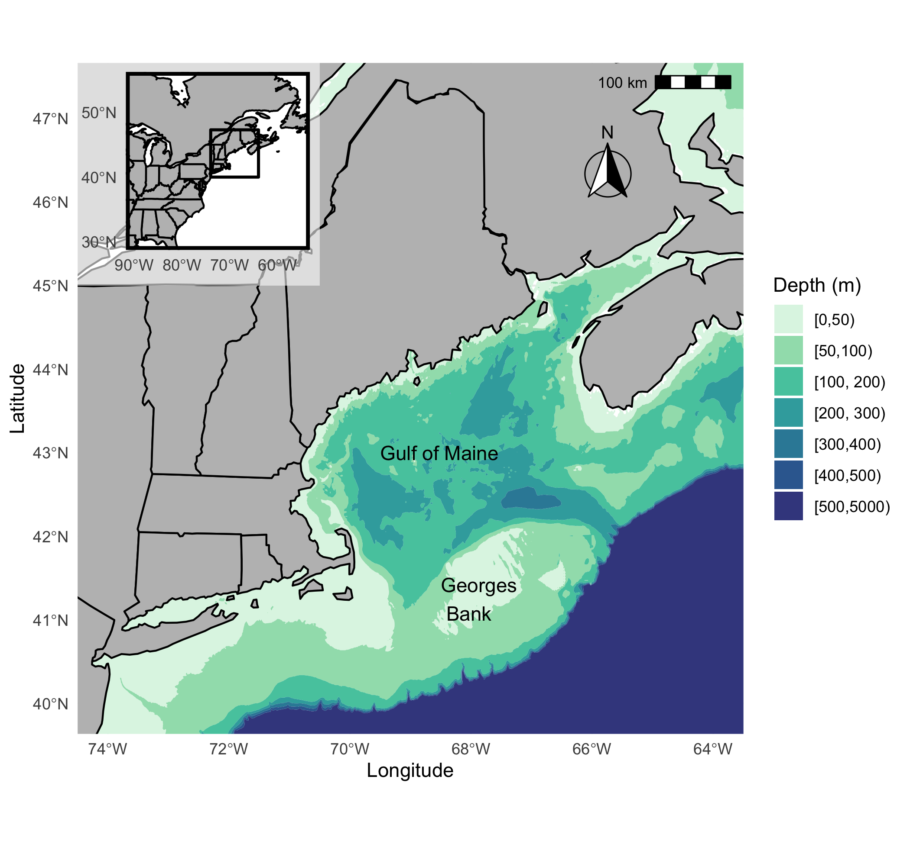

## Goals:

1\. Describe
<!--# This is probably review of data exploration from week 1 Add exploratory plots here, intro to ggplot here rather than later -->

2\. Wrangle
<!--# This is probably review of tidyverse from week 1, need to add penguins.csv data to GitHub so this code runs -->

3\. Visualize variation

4\. Visualize covariation

5\. Model

```{r setup, include=FALSE}

#install new packages:
#install.packages("ggridges",repos = "http://cran.us.r-project.org") 
#install.packages("modelr",repos = "http://cran.us.r-project.org") 
#install.packages("sf",repos = "http://cran.us.r-project.org") 
#install.packages("rnaturalearth",repos = "http://cran.us.r-project.org") 
#install.packages("wesanderson",repos = "http://cran.us.r-project.org")

# Load packages to use
library(ggridges)
library(modelr)
library(sf)
library(rnaturalearth)
library(wesanderson)

# You should already have this package installed
library(tidyverse)

# You will have to change the "working directory" to the location where you saved the data
penguins<-read_csv("C:/Users/lcarlson/Box/RWorkshops/2021/penguins_data.csv")
```

## Step 1: Describe

## Palmer penguins

*Description* There are 3 different species of penguins in this dataset,
collected from 3 islands in the Palmer Archipelago, Antarctica.

Originally published in: Gorman KB, Williams TD, Fraser WR (2014)
Ecological Sexual Dimorphism and Environmental Variability within a
Community of Antarctic Penguins (Genus Pygoscelis). PLoS ONE 9(3):
e90081. <doi:10.1371/journal.pone.0090081>

```{r}
str(penguins)
```

*Metadata*

A data frame of 344 observations on the following 7 variables:

-   species: penguin species (character)

-   island: island on each penguin was captured (character)

-   bill_length_mm: total length of culmen/bill in mm (numeric - double)

-   bill_depth_mm: total height (or depth) of culmen/bill in mm
    (numeric - double)

-   flipper_length_mm: total length of right flipper to the nearest mm
    (numeric - integer)

-   body_mass_g: body mass to the nearest g (numeric - integer)

-   sex: sex of penguin based on visual identification, possible values
    are "male", "female", and "NA"

**summary** - use summary to describe range of values \*Not to be
confused with the function summarize which is a dplyr function

```{r}
summary(penguins)
```

**table** - table is another function that is especially useful for
categorical variables. It counts the number of times each value appears

```{r}
table(penguins$species)
```

It doesn't work quite as well for numeric varibles (with the exception
of years/dates), but it can still be used.

```{r}
table(penguins$flipper_length_mm)
```

## Step 2: Wrangle

<!--# Add tibble/tidy data here so we have something to work with for visualizing -->

Let's get rid of any individuals with an NA in the sex or body_mass_g
columns and save that to a new dataframe.

We will use table() and summary() to confirm that we've removed the NA
values.

Then, let's also create a dataset which contains only Adelie penguins by
using the filter function.

```{r}
penguins_complete<-penguins %>% 
  filter(!is.na(body_mass_g)) %>% 
  filter(!is.na(sex))

table(penguins_complete$sex)

summary(penguins_complete)

adelie_penguins<-penguins_complete %>% 
  filter(species == "Adelie")

```

## Step 3: Visualize variation within variables

Let's look at the distribution of body mass for all species using the
hist() function

<!--# Use histogram to talk about base R plots -->

`hist()` - This function computes a histogram of the given data values.
The argument must be a numeric vector (a column of data is a vector).

```{r}
hist(penguins_complete$body_mass_g)
```

This and many other plots can be created using base R functions, but
`ggplot()` provides a more consistent framework to generate and combine
many different plots using tidy data as an input.

<!--# Add histogram created with ggplot - pull code from later in this document -->

By looking at these plot, can you guess what the mean might be? We can
calculate it and check.

```{r}
mean(penguins_complete$body_mass_g)
```

However, we might want to investigate each species a little more
specifically. Based on what little I know about penguins, I am think
that one species is a quite a bit bigger (thus probably weighs more)
than the others.

<!--# Replace boxplot with ggplot -->

**boxplot** is a function which allows you to produce box-and-whisker
plots of the given (grouped) values

The argument is a formula which specifies which grouping variable you
want to divide a numeric vector by.

```{r}
boxplot(penguins_complete$body_mass_g ~ penguins_complete$species)
```

We can use group_by and summarise to calculate group means.

```{r}
penguins_complete %>% 
  group_by(species) %>% 
  summarize(mean_mass = mean(body_mass_g))

```

We could also guess that sexual dimorphism would cause variation is mass
between the sexes (i.e., males are typically larger).

Let's look at those differences for Adelie penguins only.

```{r}
boxplot(adelie_penguins$body_mass_g ~ adelie_penguins$sex)
```

We can use group_by and summarise to calculate group means here as well.

```{r}
adelie_penguins %>% 
  group_by(sex) %>% 
  summarize(mean_mass = mean(body_mass_g), sd=sd(body_mass_g))

```

## Step 4: Visualize covariation

Now we may want to evaluate covariation between numeric variables, for
example, we could examine the relationship between flipper length and
body mass. What kind of relationship would you expect?

<!--# Probably want to replace the following with ggplot -->

**plot** is the generic base R plotting function that can be used to
create scatterplots, line plots, and more

The first argument is the x coordinates of the points in the plot

The second argument is the y coordinates of points in the plot

type = is an argument that tells R which type of plot should be drawn;
common options are 'p' for points, 'l' for lines, or 'n' for no plotting
(blank plotting area)

```{r}
plot(penguins_complete$flipper_length_mm, penguins_complete$body_mass_g, type = "p")
```

Let's addd some color by species and formatting

```{r}
plot(penguins_complete$flipper_length_mm, penguins_complete$body_mass_g, type = "n",xlab = "Flipper length (mm)", ylab = "Body mass (g)")

points(penguins_complete$flipper_length_mm[penguins_complete$species == "Adelie"], penguins_complete$body_mass_g[penguins_complete$species == "Adelie"], col = "red")

points(penguins_complete$flipper_length_mm[penguins_complete$species == "Chinstrap"], penguins_complete$body_mass_g[penguins_complete$species == "Chinstrap"], col = "green")

points(penguins_complete$flipper_length_mm[penguins_complete$species == "Gentoo"], penguins_complete$body_mass_g[penguins_complete$species == "Gentoo"], col = "blue")

legend(220, 3800, legend=c("Adelie", "Chinstrap", "Gentoo"),
       col=c("red", "green", "blue"),  pch = 1,   bty = "n")

```

### ggplot

Now, I want to show how you'd make the same plots using the ggplot
syntax. For this, you'll need the ggplot2 package which is loaded as
part of the tidyverse.

There are 4 aspects of ggplots you need to know about:

1.  `ggplot()` is a function that sets up the plotting environment and
    lets you set the universal aesthetic that will be applied to the
    rest of the plot (though it may be left blank if you want to add
    multiple plot layers with different aesthetics)

2.  `aes()` is a function that sets up your plot aesthetics (i.e.
    defines x- and y-axis, colors, line or point type, ect.), this
    function is an argument provided to `ggplot()`. Everything inside
    the aesthetics specification will be applied to the entire plot, or
    plot layer if `aes()` is an argument provided to a specific plot
    layer.

3.  `data` is another important argument to `ggplot()`, but if you
    intend to add multiple plot layers that rely on different data, this
    argument should be passed to the layer functions

4.  Layers that actually display the data can then be added to the plot
    using `+`, these functions usually start with 'geom'

    -   Layers can include geometries that display the data, but may
        also be functions that provide additional formatting beyond the
        settings available in `aes()` . [See a nice overview
        here.](https://ggplot2.tidyverse.org/reference/)

    -   `geom_point()` create a scatterplot, typically y is response
        variable

    -   `geom_line()` create a line plot (or add lines to a scatterplot)

    -   `geom_boxplot()` create a box and whisker plot, x is categorical
        variable

    -   `geom_histogram()` create histogram, only numeric x variable
        allowed

Because histograms only take one (numeric) variable at a time, you only
need to supply an x argument to the aes()

```{r}
hist(penguins_complete$body_mass_g)

ggplot(data=penguins_complete, aes(x=body_mass_g)) + geom_histogram(bins=8)
# the bins argument sets the number of bins in the histogram 
# delete or change the bins argument to see what happens
```

If you think about the way a boxplot is formatted, the categories are
typically on the x axis and the numeric variables range on the y.

```{r}
boxplot(adelie_penguins$body_mass_g ~ adelie_penguins$sex)

ggplot(data=adelie_penguins, aes(x=sex, y=body_mass_g)) + geom_boxplot() + stat_boxplot(geom ='errorbar', width = 0.5)
```

ggplot excels at multi-variable plots as compared to base graphics.

Here's the basic scatterplot:

```{r}
plot(penguins_complete$flipper_length_mm, penguins_complete$body_mass_g, type = "p")

ggplot(data=penguins_complete, aes(x=flipper_length_mm, y=body_mass_g)) + geom_point()
```

And the more advanced versions

Note: ggplot will automatically assign colors, but you can manually
change them as well (will discuss later)

```{r}
plot(penguins_complete$flipper_length_mm, penguins_complete$body_mass_g, type = "n",xlab = "Flipper length (mm)", ylab = "Body mass (g)")

points(penguins_complete$flipper_length_mm[penguins_complete$species == "Adelie"], penguins_complete$body_mass_g[penguins_complete$species == "Adelie"], col = "red")

points(penguins_complete$flipper_length_mm[penguins_complete$species == "Chinstrap"], penguins_complete$body_mass_g[penguins_complete$species == "Chinstrap"], col = "green")

points(penguins_complete$flipper_length_mm[penguins_complete$species == "Gentoo"], penguins_complete$body_mass_g[penguins_complete$species == "Gentoo"], col = "blue")

legend(220, 3800, legend=c("Adelie", "Chinstrap", "Gentoo"),
       col=c("red", "green", "blue"),  pch = 1,   bty = "n")


# ggplot version:

ggplot(data = penguins_complete, aes(x=flipper_length_mm, y=body_mass_g,color=species)) + geom_point()
```

`geom_line()` will create a line graph (connect each datapoint with a
line)

This may be useful in some cases, but to add a modeled line to the plot,
you'll want to use geom_smooth()

```{r}
ggplot(data = penguins_complete, aes(x=flipper_length_mm, y=body_mass_g,color=species)) + geom_point() + geom_line()
```

`geom_smooth()` plots a modeled line through your data, responds to
grouping variables so long as they are specified in the global aes

The default method is a nonlinear model (loess), but in this case, a
simple "lm" is appropriate

```{r}
ggplot(data = penguins_complete, aes(x=flipper_length_mm, y=body_mass_g,color=species)) + geom_point() + geom_smooth(method="lm")
```

Faceting allows you to create a unique plot for each grouping variable
with the same characteristics

This is especially helpful when you want to group by or visualize
multiple categorical variables (for example, species and sex) but it
would be too overwhelming to look at all at one time

`facet_wrap()` allows multiple panels by some grouping variable,
specified panel layout; the argument is a tilde \~ followed by the
grouping variable (in this case, I used species)

`theme()` is used to specify various plotting theme elements such as
changing the background color, removing axis or panel borders, and
changing text colors

`labs()` is used to change the name of axis and legend labels

```{r, fig.height=3, fig.width=9}
ggplot(data = penguins_complete, aes(x=flipper_length_mm, y=body_mass_g,color=sex)) + 
  geom_point() + 
  geom_smooth(method="lm") +
  facet_wrap(~species, ncol=3) + 
  theme(panel.grid = element_blank()) + 
  labs(x="Flipper length (mm)", y="Body mass (g)", color="Sex")
```

## Step 5: Model

## t-tests

Inferential statistic used to study if there is a statistical difference
between two groups

Assumes that the means of the two distributions are equal (H₀: µ₁=µ₂)

If the t-test rejects the null hypothesis, the groups are likely
different

### In practice:

*Q:* Would you guess that there will be significant differences in mean
body mass between males and females? *A:*

#### 1. Create a ridgeplot showing the distribution of body mass by sex for Adelie penguins.

We will use the adelie_penguins data here

I used a denisty ridgeplot rather than a histogram, because the
"stacked" nature of a regular histogram makes it difficult to spot
inter-group differences. Ridgeplots are created by the ggridges package

*scale_fill_manual()* allows you to manually specify different colors
for each grouping variable by referring to either color names (i.e.,
blue, green) or their html hex codes

*theme()* there are lots of new "theme" arguements here. You can mess
around with them to see what they do, but overall, you don't need to pay
much attention to them

```{r}
adelie_penguins %>% 
  ggplot(aes(x=body_mass_g, y = sex, fill=sex)) + 
  ggridges::geom_density_ridges(rel_min_height = 0.001, scale = 0.9) + 
  scale_fill_manual(values = c("#ABB400","#00608A")) +
  labs(x="Body mass (g)", y="", title = "Adelie penguin body mass by sex") +
  theme(panel.grid = element_blank(), 
        panel.border = element_blank(), 
        axis.line.x = element_line(color = "black"), 
        axis.line.y = element_blank(),
        axis.ticks.x = element_line(color = "black"), 
        axis.ticks.y = element_blank(),
        axis.text.x = element_text(size=14), 
        axis.text.y = element_text(size=14), 
        axis.title = element_text(size=14), 
        legend.position = "none")
```

#### 2. Run a t-test to compare the mean body mass of male and female penguins.

```{r}
bodymass_test<-t.test(body_mass_g ~ sex, data = adelie_penguins)
bodymass_test
```

Ho: mean mass of males = mean mass of females Ha: mean mass of females ≠
mean mass of females

*p-value* the probability of obtaining test results at least as extreme
as the results observed during the test, assuming that the null
hypothesis is correct

*Q:* How would you explain the results of this t-test in words? *A:*

## ANOVA

Compares the means between the groups, determines statistical
differences Calculates between group variance, within group variance, F
statistic

Null assumes that the means of the all distributions are equal 𝐻_𝑜: 𝜇_1=
𝜇_2 = 𝜇_3

Cannot tell you which specific groups are statistically significantly
different from each other, only that there is at least one difference To
determine which specific groups differed from each other, you need to
use a post hoc test such as TukeyHSD

ANOVA Assumptions:

-   Independence of the observations -- Each subject should belong to
    only one group. There is no relationship between the observations in
    each group. Having repeated measures for the same participants is
    not allowed.

-   No significant outliers -- Can check using boxplot or function such
    as rstatix::identify_outliers()

-   Normally distributed -- Use histogram for raw data, Q-Q plots,
    shapiro_test() on model object

-   Homogeneity of variances -- View residuals vs. fitted plot by using
    plot() on model object

#### 1. Create a ridgeplot showing the distribution of body mass by site/island for Adelie penguins.

Compared to the male/female difference, there doesn't seem to be much of
an obvious difference between these three.

*Q:* Would you guess that there will be significant differences in mean
body mass between islands? *A:*

```{r}
adelie_penguins %>% 
  ggplot(aes(x=body_mass_g, y = island)) + 
  ggridges::geom_density_ridges(rel_min_height = 0.001, scale = 0.9) + 
  labs(x="Body mass (g)", y="", title = "Adelie penguin body mass by site") +
  theme(panel.grid = element_blank(), 
        panel.border = element_blank(), 
        axis.line.x = element_line(color = "black"), 
        axis.line.y = element_blank(),
        axis.ticks.x = element_line(color = "black"), 
        axis.ticks.y = element_blank(),
        axis.text.x = element_text(size=14), 
        axis.text.y = element_text(size=14), 
        axis.title = element_text(size=14), 
        legend.position = "none")
```

#### 2. Run an ANOVA on the relationship between body mass and site/island.

Ho: mean mass at Torgersen = mean mass at Dream = mean mass at Biscoe
Ha: mean mass at Torgersen ≠ mean mass at Dream ≠ mean mass at Biscoe

The aov() function is in the stats package.

```{r}
bodymass_aov <- aov(body_mass_g ~ island, data=adelie_penguins)
summary(bodymass_aov)
```

Based on the p-value (almost 1, much higher than the alpha level of
0.05), it seems unlikely that site/island has anything to do with body
mass. The intra-group variability in body mass is far greater than the
inter-group variability.

*Q:* How would you explain the results of this ANOVA in words? How do we
know if an ANOVA is an appropriate way to test these data? *A:*

Maybe you answered that you need to check assumptions, and that would be
correct. Here, we will ensure ANOVA assumptions are being satisfied.

-   Independence of the observations

-   No significant outliers

-   Normally distributed

-   Homogeneity of variances

*Q:* How do we know that observations are independent? *A:*

Check for outliers using a boxplot.

*Q:* What would you expect to see in this plot if there were extreme
outliers? *A:*

```{r}
boxplot(adelie_penguins$body_mass_g ~ adelie_penguins$island)
```

Check for normal distribution (Q-Q) and homogeneity of variance
(residuals vs. fitted).

*Q:* Does that data satisfy the assumptions of the ANOVA? *A:*

```{r}
island_mod<-lm(adelie_penguins$body_mass_g ~ adelie_penguins$island)

plot(island_mod)
```

## What is a model?

**A representation for a purpose** \* Identify patterns in data
<!--# test & develop hypotheses, inform predictions, should this section preceed t-tests and ANOVA?-->

-   Classify events

-   Untangle multiple influences

-   Assess strength of evidence

Statistical models are a special type of mathematical model which are
informed by data. They incorporate uncertainty and randomness

Why do we create models?

1.  Explanation -- we care about understanding the form of our model, in
    particular, quantifying relationships between the response and
    explanatory variables

2.  Prediction -- we don't care so much about how our model arises, only
    that it does a good job predicting the response based on the
    explanatory variables

### Model nomenclature:

-   Variability/spread - refers to how spread out a set of data is

-   Response variable/outcome variable -- variable whose variation
    depends on other variables

-   Explanatory variable/predictor variable -- explains variations in
    the response variable

-   Covariate -- an explanatory variable that is not primary explanatory
    variable of interest, but that may be important to the shape of the
    response variable

### Objects needed for modelling in R:

Data frame -- collection of variables Function -- tool used to build and
evaluate models Formula -- a way to describe how you want to relate
variables to each other

A formula contains the response variable seperated by a tilde \~ from
the explanatory variable

For example:

lm(body_mass_g \~ flipper_length_mm, data = adelie_data)

In English: "Body mass as a function of flipper length" "Body mass given
flipper length"

### Steps of model design:

1.  Get dataset
2.  Specify response and explanatory variables of interest
3.  Select a model architecture i.e., linear model: lm()
4.  Fit/train a model
5.  Evaluate the model

\*decisions the modeler makes have an impact on the results

## Simple linear regression <!--# May be good to discuss GLMs/GAMs -->

What is the statistical relationship between X and Y? 𝑌=𝑎+𝑏𝑋 where 𝑎 and
𝑏 are the estimated parameters intercept and slope

Scenario: On day 3, a scale was broken by an angry male penguin kicking
it across ice, backup scale battery died after first penguin. We were
unable to collect mass data all day.

Solution: Can we use flipper length to predict body mass of Adelie
penguins that we couldn't weigh today?

We are interested in predicting body mass based on flipper length.
First, let's visualize a likely relationship between flipper length and
body mass.

*Q:* Which is the response variable and why? *A:*

```{r}
ggplot(adelie_penguins, aes(x=flipper_length_mm, y = body_mass_g)) + geom_point() + 
  geom_smooth(method="lm", se = F, color = "darkgrey") + 
  labs(x="Flipper length (mm)", y = "Body mass (g)", title = "Adelie penguins only") 
```

Create a model of body mass as a function of flipper length, where the
coefficients should be given relative to zero (fit without an intercept
term). The modeling architecture should use lm().

```{r}
flipper1<-lm(body_mass_g ~ flipper_length_mm + 0, data = adelie_penguins)
flipper1
summary(flipper1)
```

Now, create a testing dataset that we will use to predict unknown
body_mass_g for penguins with known flipper_length_mm. To do this, we
will use the function runif() which draws random numbers (length of n)
from a uniform distribution between the specified min and max. I set the
min to the minimum of the "training dataset" and the max to the maximum
of the training dataset.

Another way to do this is to hold back data from the original dataset to
use as the testing dataset, but for these purposes, we'll just simulate
data and pretend this is data from "Day 3" where an angry penguin broke
our scales.

```{r}
test_data<-data.frame(flipper_length_mm = runif(n = 25, 
                                                min = min(adelie_penguins$flipper_length_mm),
                                                max = max(adelie_penguins$flipper_length_mm)))

head(test_data)
```

Predict values for the response variable based on the flipper1 model and
the testing dataset using the predict() function.

Pull out values of the "fitted" values of the response and name it
"predicted_mass."

Calculate values for the upper and lower standard error associated with
this fit.

Store all of those values in mass_flipper_preds.

```{r}
mass_preds<-predict(flipper1, test_data, type = "response", se.fit = T)

predicted_mass<-as.vector(mass_preds$fit)

upr<-as.vector(mass_preds$fit + (2 * mass_preds$se.fit))
lwr<-as.vector(mass_preds$fit - (2 * mass_preds$se.fit))


mass_flipper_preds<-data.frame(flipper_length_mm = test_data$flipper_length_mm, 
                               predicted_mass = predicted_mass, 
                               lwr=lwr, 
                               upr=upr)
head(mass_flipper_preds)
```

Plot the training dataset (black points) as well as fitted values and
the trendline (green points and line).

*Q:* How well does this model seem to fit? What could you do to improve
it? *A:*

```{r}
ggplot() +    #note that global aes() is blank because we're plotting more than one dataset
  geom_point(data=adelie_penguins, aes(x=flipper_length_mm, y = body_mass_g), color="black") + 
  geom_point(data=mass_flipper_preds, aes(x=flipper_length_mm, y=predicted_mass), color = "#ABB400") +
  geom_line(data=mass_flipper_preds, aes(x=flipper_length_mm, y=predicted_mass), color = "#ABB400") + 
  geom_line(data=mass_flipper_preds,aes(x=flipper_length_mm, y=upr), lty=2, color="#ABB400") + 
  geom_line(data=mass_flipper_preds,aes(x=flipper_length_mm, y=lwr), lty=2, color="#ABB400") +
  labs(x="Flipper length (mm)", y = "Body mass (g)", title = "Adelie penguins only") 
```

### Linear regression with a categorical covariate

Perhaps you said you could improve the model by adding "sex" as a
covariate.

Create a model of body mass as a function of flipper length and sex (no
interaction), where the coefficients should be given relative to zero
(fit without an intercept term). The modeling architecture should use
lm().

```{r}
flipper2<-lm(body_mass_g ~ flipper_length_mm + sex + 0, data = adelie_penguins)
flipper2
summary(flipper2)
```

We can use the add_predictions() function in the modelr package to get
predictions of body_mass_g for values of flipper_length_mm in our
*training* dataset. This is different from predicting based on our new
*testing* dataset (we'll do this later).

Plot the training dataset by sex (blue dots = male, green dots = female)
as well as predicted values (blue and green triangles) and the trendline
(blue and green lines) based on the training dataset.

The grey segments represent the difference between the predicted and
observed values. The goal is create a model that minimizes these
differences.

```{r}
adelie_penguins %>% 
  modelr::add_predictions(flipper2) %>% 
  ggplot() + 
geom_segment(aes(x = flipper_length_mm, y = body_mass_g, xend = flipper_length_mm, yend = pred), color = "darkgrey") +
  geom_point(aes(flipper_length_mm, pred, color = sex), pch=17, size=2) +
  geom_line(aes(flipper_length_mm, pred, color = sex)) +
  geom_point(aes(x=flipper_length_mm, y = body_mass_g, color = sex)) + 
  scale_color_manual(values = c("#ABB400","#00608A")) +
  labs(x="Flipper length (mm)", y = "Body mass (g)", title = "Adelie penguins only", color = "") +   
  theme(legend.position = c(0.1, 0.9)) 
```

We can also evaluate our model by looking at the residuals. They should
be randomly distributed around the y=0 line. If there is a trend in the
residuals, the model is probably missing something important.

```{r}
adelie_penguins %>% 
  modelr::add_residuals(flipper2) %>% 
  ggplot(aes(flipper_length_mm, resid)) + 
  geom_hline(yintercept = 0) +
  geom_point() 
```

Now, create a testing dataset that we will use to predict unknown
body_mass_g for penguins with known flipper_length_mm. For this dataset,
we need to similate data for both sexes. Because we established earlier
that body mass varies by sex, we need to simulate the data
differentially by sex.

To do this, simulate two datasets with length 25 each, with "sex" as a
identifier column, then combine them using bind_rows().

```{r, warning=F, message=F}
test_data_female<-data.frame(flipper_length_mm = runif(n = 25, 
                                          min = min(adelie_penguins$flipper_length_mm[adelie_penguins$sex == "female"]),
                                          max = max(adelie_penguins$flipper_length_mm[adelie_penguins$sex == "female"])), 
                             sex = "female")

test_data_male<-data.frame(flipper_length_mm = runif(n = 25, 
                                          min = min(adelie_penguins$flipper_length_mm[adelie_penguins$sex == "male"]),
                                          max = max(adelie_penguins$flipper_length_mm[adelie_penguins$sex == "male"])), 
                             sex = "male")

test_data2<-bind_rows(test_data_female, test_data_male)

head(test_data2); tail(test_data2)
```

Predict using the predict function based on the flipper2 model and the
test_data2 dataset. Store all of those values in mass_flipper_preds2.

```{r}
mass_preds2<-predict(flipper2, test_data2, type = "response", se.fit = TRUE)

predicted_mass2<-as.vector(mass_preds2$fit)

upr2<-as.vector(mass_preds2$fit + (2 * mass_preds2$se.fit))
lwr2<-as.vector(mass_preds2$fit - (2 * mass_preds2$se.fit))

mass_flipper_preds2<-data.frame(sex = test_data2$sex, 
                                flipper_length_mm = test_data2$flipper_length_mm, 
                                predicted_mass = predicted_mass2,
                                lwr=lwr2, 
                                upr=upr2)

head(mass_flipper_preds2)
```

Plot the training dataset by sex (blue dots = male, green dots = female)
as well as fitted values (blue and green triangles) and the trendline
(blue and green lines) based on the testing dataset.

*Q:* How well does this model seem to fit compared to the model that
doesn't account for sex? How could we compare the models? *A:*

```{r}
ggplot() + 
  geom_point(data=adelie_penguins, aes(x=flipper_length_mm, y = body_mass_g, color = sex)) + 
  geom_point(data=mass_flipper_preds2, aes(x=flipper_length_mm, y=predicted_mass, color = sex), pch=17, size=2) +
  geom_line(data=mass_flipper_preds2, aes(x=flipper_length_mm, y=predicted_mass, color = sex)) + 
  geom_line(data=mass_flipper_preds2,aes(x=flipper_length_mm, y=upr, color = sex), lty=2) + 
  geom_line(data=mass_flipper_preds2,aes(x=flipper_length_mm, y=lwr, color = sex), lty=2) +
  scale_color_manual(values = c("#ABB400","#00608A")) +
  labs(x="Flipper length (mm)", y = "Body mass (g)", title = "Adelie penguins only", color = "") +   
  theme(legend.position = c(0.1, 0.9)) 
```

Simple regression, coefficient of variation and residual standard error

```{r}
mod1_summary<-summary(flipper1)

mod1_summary$adj.r.squared

mod1_summary$sigma
```

Regression with categorical covariate, coefficient of variation and
residual standard error

```{r}
mod2_summary<-summary(flipper2)
mod2_summary$adj.r.squared
mod2_summary$sigma

```

*Q:* Based on these values, which is the better model? Is it much
better, or just a little bit better? What else could help you decide?
*A:*

#### BONUS

*Q:* What other models could we write based on the adelie_penguins data?
What if we were using the whole penguins dataset? Could we use species
as a covariate when modelling this relationship? Why or why not? *A:*

### More modeling in R

There are many types of models, and R is flexible for writing models in
nearly any way you'd like

Other R model functions: lme(), glm(), gam(), nls()

These models have different arguments and require you to write the
formula appropriately, but the functions are all applied in much the
same way as lm()

There are also many methods for model selection and evaluation, but
ultimately, many decisions are up to you (the modeller)!

## Mapping

Load in data from github

Filter only Montana schools, remove non-plausible mmr values, and select
distinct cases

```{r}

measles<-read_csv("https://raw.githubusercontent.com/LGCarlson/tidytuesday/master/data/2020/2020-02-25/measles.csv")

mt_meas<-measles %>% 
  filter(state == "Montana") %>% 
  filter(mmr > 0) %>% 
  distinct(index,state,name,county,enroll,mmr, .keep_all = T)

```

Load in spatial datasets

```{r}
# load in world and state sf
world <- rnaturalearth::ne_countries(scale = "medium", returnclass = "sf")
states <- sf::st_as_sf(map("state", plot = FALSE, fill = TRUE))

# load in county data
load(url("https://github.com/mgimond/ES218/blob/gh-pages/Data/counties48.RData?raw=true"))

# create wesanderson palette 
pal <- wesanderson::wes_palette("Zissou1", 100, type = "continuous")
```

###### County-level processing:

-   Seperate ID into state and county names

-   Filter only Montana data

-   Change the case of "county" so that it matches measles data
    formatting

```{r}
mtcounties<-cnty %>% 
  separate(col=ID, into = c("state","county"),sep = ",", remove = F) %>%    
  filter(state=="montana") %>%                                       
  mutate(county = snakecase::to_upper_camel_case(county))   
```

See what shapefiles are loaded by rnatruralearth:

```{r}
ggplot(data = world) + geom_sf(fill="blue") +     # plots world data
  geom_sf(data = states, fill="red")              # plots state boundaries
```

#### Make a basic map to explore distribution of schools/school sizes throughout the state

```{r, warning=F, message=F,echo=F}
ggplot(data = world) + geom_sf() +     # plots world data
  geom_sf(data = states) +             # plots state boundaries
  geom_sf(data=mtcounties) +           # plots county boundaries
  coord_sf(xlim = c(min(mt_meas$lng,na.rm = T)-1,max(mt_meas$lng,na.rm = T)+1),
           ylim = c(min(mt_meas$lat,na.rm = T)-1, max(mt_meas$lat,na.rm = T)+1),expand = FALSE) +
                                       # sets area of plot
  geom_point(data=mt_meas, aes(x=lng,y=lat, color = mmr, size=enroll))   # plots datapoints by frame size
```

#### Summarize data by county

```{r}
# summarize measles data by county
mt1<-mt_meas %>% 
  filter(name != "West Valley School Prek-6") %>%    # extreme outlier, something wrong with this datapoint
  group_by(county) %>% 
  mutate(xmt = (xrel + xmed + xper)) %>% 
  mutate(totalvacc = enroll*(mmr/100)) %>% 
  mutate(unvacc = enroll-totalvacc) %>% 
  summarise(mean_mmr=mean(mmr,na.rm = T), sum_exmt = sum(xrel,na.rm = T), total_unvacc = sum(unvacc,na.rm = T)) 

# join summarized measles data to county spatial data
mt2<-mt1 %>%
  mutate(round_unvacc = paste(round(mean_mmr,0),"%",sep = "")) %>% 
  left_join(mtcounties, by = "county") 
```

```{r}

# create plot of mean mmr vaccination rate by county
mmrplot<-ggplot(data = world) + geom_sf() + geom_sf(data = states) + geom_sf(data=mtcounties) +
  geom_sf(data=mt2$geometry, aes(fill=mt2$mean_mmr)) +
  coord_sf(xlim = c(min(mt_meas$lng,na.rm = T)-1,max(mt_meas$lng,na.rm = T)+1),
           ylim = c(min(mt_meas$lat,na.rm = T)-1, max(mt_meas$lat,na.rm = T)+1),expand = FALSE) +
  scale_x_continuous(breaks=seq(-116,-104,4)) + 
  scale_y_continuous(breaks=seq(43,49,3)) + 
  scale_fill_gradientn(colours = rev(pal)) +
  labs(fill="", x="",y="") + 
  theme(legend.position = c(0.1, 0.2), legend.background = element_blank(), legend.title = element_text(size=10)) + 
  labs(title="Mean MMR vaccination rate (percent vaccinated)")


# create plot of number unvaccinated by county
unvaccplot<-ggplot(data = world) + geom_sf() + geom_sf(data = states) + geom_sf(data=mtcounties) +
  geom_sf(data=mt2$geometry, aes(fill=(mt2$total_unvacc))) +
  coord_sf(xlim = c(min(mt_meas$lng,na.rm = T)-1,max(mt_meas$lng,na.rm = T)+1),
           ylim = c(min(mt_meas$lat,na.rm = T)-1, max(mt_meas$lat,na.rm = T)+1),expand = FALSE) +
  scale_x_continuous(breaks=seq(-116,-104,4)) + 
  scale_y_continuous(breaks=seq(43,49,3)) + 
  scale_fill_gradientn(colours = pal) +
  labs(fill="", x="",y="") + 
  theme(legend.position = c(0.1, 0.2), legend.background = element_blank(), legend.title = element_text(size=10)) + 
  labs(title="Number unvaccinated by county")

unvaccplot
```

### Mean MMR vaccination rate (percent vaccinated)

```{r, fig.height=6, fig.width=8, warning=F, message=F,echo=F}
mmrplot +
  geom_sf_text(data = mt2$geometry, aes(label = mt2$round_unvacc), size=2.8) + 
  labs(title="Mean MMR vaccination rate (percent vaccinated)")
```

#### Counties with most unvaccinated students (top 10 counties)

```{r, echo=F}
mt1 %>% 
  filter(mean_mmr>0) %>% 
  arrange(desc(total_unvacc)) %>% 
  head(10) 

```

<!--# Do we want to keep the above (nice example of combining data wrangling and plotting? or stick with building a map of the Gulf of Maine -->

Creating maps with `ggplot` follows the same

There are many different ways to generate maps in R, but `ggplot`
provides a good starting point and uses a structure we are already
familiar with. However, there are a few key differences between maps and
the plots we've discussed so far that can make mapping difficult:

1.  Maps often contain multiple layers of data (e.g. your data,
    political boundaries, topography, bathymetry, ect.) & ORDER MATTERS!

2.  We are generally plotting shapes rather than individual points (e.g.
    polygons or shapefiles)

3.  Over a large enough area we need to account for the curvature of the
    earth (i.e. pick an appropriate projection)

### Let's practice by making a map of the Gulf of Maine

Load some additional packages that are useful for mapping:

```{r}
# library(tidyverse) # Contains ggplot and some useful political boundary shapes
library(marmap) # Contains NOAA bathymetric data 
library(rgdal) # Needed to use marmap
library(raster) # Needed to use marmap
library(sf) # Simple features (sf) is another plotting software in R that can make plots independently or can be used to add map layers in ggplot
library(mapdata) # Political boundaries
library(ggspatial) # Helps add map features
```

The first (bottom) layer of our map should be the ocean bathymetry. This
isn't data most of us will be collecting so we can borrow it from NOAA
via the `marmap` package.

```{r}
# Pull NOAA bathymetry data, you must provide the latitude/longitude bounds and a resolution (higher resolutions take more time to process)
Bathy <- getNOAA.bathy(lon1 = -75, lon2 = -62,
                       lat1 = 39, lat2 = 48, resolution = 1)

# Now do a bit of data wrangling so we can plot it:
# Convert data to matrix
Bathy_Final <- as.matrix(Bathy)
class(Bathy_Final) <- "matrix"

# Now reshape it to long format and plot
BathyData <- Bathy_Final %>%
  as.data.frame() %>% # Convert the matrix to a data.frame
  rownames_to_column(var = "lon") %>% # Switch to long format
  gather(lat, value, -1) %>%
  mutate_all(funs(as.numeric)) # Make everything a number
```

Now we can start with our map

```{r}
  ggplot() +
  geom_contour(data = BathyData, aes(x = lon, y = lat, z = value), 
               bins = 50, colour = "black")  # bins determine # of contours (try 50 vs. 100)
        
```

This is a good start, but there are a few things we could change to make
it more visually appealing:

-   Update the x- and y-axis labels

-   Improve the coloring

-   Get rid of the default grey background

-   Fix the weird horizontal stretch

-   Get rid of the dense bathymetric lines near the shelf-break because
    we just want a nice map of the Gulf of Maine

```{r}
ggplot() +
  geom_contour_filled(data = BathyData, aes(x = lon, y = lat, z = value), 
                      breaks = c(0, -50, -100, -200, -300, -400, -500, -5000)) + # Specify custom bathymetric lines to keep
  xlab("Longitude") + # Update axis labels
  ylab("Latitude") +   
  scale_fill_manual(values =  c("#DEF5E5FF", "#A0DFB9FF", "#54C9ADFF", "#38AAACFF", "#348AA6FF", "#366A9FFF", "#40498EFF"), name = "Depth (m)", labels = c("[0,50)", "[50,100)", "[100, 200)", "[200, 300)", "[300,400)", "[400,500)", "[500,5000)" )) + # Pick specific colors and label them to match the bathymetric lines so we end up with a nice legend
  coord_sf(xlim = c(-74, -64),  ylim = c(40, 47.3)) + # Trim the map dimensions a bit and fix the horizontal stretch. !!! Change this if you want to zoom in/out on a specific area
  theme_minimal() # Change the background theme, there are lots of options to explore
  
```

We could have colored everything with an elevation of 0+ a different
color, but I didn't care about having a high-resolution coastline so I
am going to add a lower-resolution coastline next.

```{r}
# First I need to load US and Canadian political boundaries from two different sources

##### US States Shape - pulled from a shape file that includes state boundaries using the sf package
US <- st_read(dsn = here::here("Intro_to_R", "Data", "US_shapefile", "cb_2018_us_state_20m.shp")) # Shape files downloaded from the internet or borrowed from ArcGIS often come with extra files that contain metadata ('.cpg', '.dbf', '.prg', '.shp', '.shp.ea.iso.xml', '.shp.iso.xml', '.shx'), if things break reading in or plotting this data you may need to download several of these files 

# Transform coordinates to projected coordinates
US_trans <- st_transform(US, "+proj=longlat +ellps=WGS84 +datum=WGS84")
# Be careful to ensure that your projected coordinates match across plots!!!

# head(US) # take a look at the data before and after transforming
# head(US_trans)

##### Canada - pull from mapdata package
Canada <- map_data("world", "Canada")
```

```{r}
ggplot() +
  geom_contour_filled(data = BathyData, aes(x = lon, y = lat, z = value), 
                      breaks = c(0, -50, -100, -200, -300, -400, -500, -5000)) + 
  xlab("Longitude") + 
  ylab("Latitude") +   
  scale_fill_manual(values =  c("#DEF5E5FF", "#A0DFB9FF", "#54C9ADFF", "#38AAACFF", "#348AA6FF", "#366A9FFF", "#40498EFF"), name = "Depth (m)", labels = c("[0,50)", "[50,100)", "[100, 200)", "[200, 300)", "[300,400)", "[400,500)", "[500,5000)" )) + 
  geom_polygon(data = Canada, color = "black", fill = "gray", aes(x=long, y=lat, group=group)) +  # Add Canada
  geom_sf(data = US_trans, color="black", fill = "gray") + # Add the US, 'color' specifies the line color and 'fill' changes the shape color
        
  # Keep your formatting at the end so it overwrites any formatting that comes with new data layers/polygons/shapes
  coord_sf(xlim = c(-74, -64),  ylim = c(40, 47.3)) + 
  theme_minimal() 
  
```

This is a decent map, but there are often feature required for
publication that we should think about:

-   Key geographic features that we want to label

-   Inset maps to show the broader geographic region

-   Compass and scale bars

-   Sampling locations or other data layers

To add an inset map, first we need to make the inset map separately:

```{r}
# Set up bounds for the area your broader map covers (this draws a box around the area you plotted in more detail), THIS MUST MATCH THE LIMITS specified in coord_sf()!!!!
Region <- data.frame(long = c(-74, -74, -64, -64, -74),
                     lat = c(40, 47.3, 47.3, 40, 40)) # First and last points need to match in order for the resulting region to be a closed shape

# Create a map of the broader region & turn it into a grob
NorthAmerica <- ggplotGrob(ggplot() +
                             geom_polygon(data = Canada, color = "black", fill = "gray", aes(x=long, y=lat, group=group)) + # Add Canada
                             geom_sf(data = US_trans, color="black", fill = "gray") + # Add US
                             scale_x_continuous(breaks = seq(-60, -90, by = -10)) + # Must be negative or plotted in E hemisphere
                             scale_y_continuous(breaks = seq(30, 60, by = 10)) +
                             coord_sf(xlim = c(-90, -55),  ylim = c(30, 55)) + # Zoom in on the broader region showed in the inset map
                             geom_path(data = Region, aes(x = long, y = lat), size = 0.8, color = "black")  + # Plot the box around the region showed in the main map
                             theme_bw() + # Use a simple theme for the inset plot
                             theme(line = element_blank(), panel.border = element_rect(colour = "black", fill = NULL, size = 2), panel.background = element_rect(fill = "white"), plot.background = element_rect(fill = "transparent", colour = NA), axis.title.x = element_blank(), axis.title.y = element_blank()) # Remove the background for the plot
)

# Make a semi-transparent box to use as a background for your inset map so you can actually read the x- and y-axis labels for the inset
boarderData <- list(LATITUDE = c(45, 45, 47, 47),
                    LONGITUDE = c(-74, -70.5, -70.5, -74)) %>% as.data.frame() # Lat/long where we want to place the background for the inset map

boarderPlot <- ggplotGrob(ggplot(boarderData, aes(x=LONGITUDE, y=LATITUDE), ) +
  geom_rect(xmin = -74.6, xmax = -70.3, ymin = 44.9, ymax = 47.7, alpha = 0.2, fill = "white") +
  theme_void() +
  theme(line = element_blank(), plot.background = element_rect(fill = "transparent", colour = NA), axis.title.x = element_blank(), axis.title.y = element_blank()) )

```

Then we can add the pre-generated map as a grob (graphic object), and
add the other map features:

```{r}
 ggplot() +
  geom_contour_filled(data = BathyData, aes(x = lon, y = lat, z = value), 
                      breaks = c(0, -50, -100, -200, -300, -400, -500, -5000)) +
  xlab("Longitude") +
  ylab("Latitude") +   
  scale_fill_manual(values =  c("#DEF5E5FF", "#A0DFB9FF", "#54C9ADFF", "#38AAACFF", "#348AA6FF", "#366A9FFF", "#40498EFF"), name = "Depth (m)", labels = c("[0,50)", "[50,100)", "[100, 200)", "[200, 300)", "[300,400)", "[400,500)", "[500,5000)" )) +
  geom_polygon(data = Canada, color = "black", fill = "gray", aes(x=long, y=lat, group=group)) + 
  geom_sf(data = US_trans, color="black", fill = "gray") +
  coord_sf(xlim = c(-74, -64),  ylim = c(40, 47.3)) +
  theme_minimal() + 
  theme(plot.background = element_rect(color = "white")) +
         
  # Add labels for oceanographic regions
  annotate("text", x = -68.5, y = 41.25, label = "Georges \n Bank", hjust=0) +
  annotate("text", x = -69.5, y = 43, label = "Gulf of Maine", hjust=0) +

  # Add the background for the inset map grob (ORDER MATTERS, be sure to add the background layer first, then add the inset map layer)
  annotation_custom(grob = boarderPlot, xmin = -74.6, xmax = -70.5, ymin = 45, ymax = 47.7) +
  # Add the inset map of North America
  annotation_custom(grob = NorthAmerica, xmin = -74.6, xmax = -70.5, ymin = 45, ymax = 47.7) +

  # Add other map features
  annotation_scale(location = "tr", width_hint = 0.2) + # Add scale bar
  annotation_north_arrow(location = "tr", which_north = "true", pad_x = unit(0.75, "in"), pad_y = unit(0.5, "in"), style = north_arrow_fancy_orienteering) # Add a compass rose

```

This warning means that this map is large enough that the curvature of
the earth may result in scale inaccuracies:

    Scale on map varies by more than 10%, scale bar may be inaccurate

There is a 50/50 chance that these new features are in the wrong
location, overlap, or otherwise don't look the way we would hope. Many
map and plot features (including things like labels) are placed using
relative locations, which often don't translate well when figure sizes
change (e.g. when you change the width of your RStudio window). To avoid
this, be sure to save your nicely formatted plots WITH DIMENSIONS
SPECIFIED!

```{r}
ggsave(filename = here::here("Intro_to_R", "Figures", "GB-GOM-Map.png"),  height = 6.5) # By default ggsave saves the last plot generated
```

### Here is the final map!


