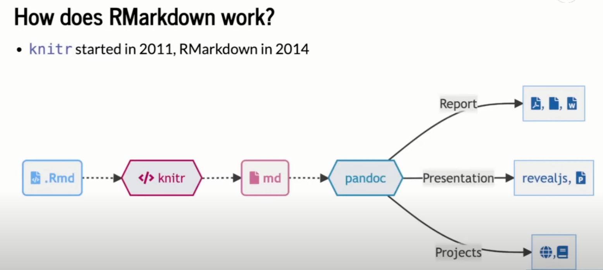

```{r setup, include=FALSE}
knitr::opts_chunk$set(echo = TRUE)
```

{fig-alt="Twitter post by Jonathan Kitt with the phrase 'Me, still learning Rmarkdown... quarto, quarto everywhere.'" width="551" fig-align="center"}

# Why Quarto?

If you already use markdown or RMarkdown, you may ask yourself "why switch to quarto?" As new quarto users, our switch has been mostly driven by improved access to a wide variety of formatting options and tools to make the code and documents we already write better.

This switch **also** revealed a lot of Rmarkdown tricks that we were not aware of, that carry over to Quarto as well.

## RMarkdown: The familiar

This is an R Markdown document. Markdown is a simple formatting syntax for authoring HTML, PDF, and MS Word documents. For more details on using R Markdown see [their documentation page](http://rmarkdown.rstudio.com)

When you click the Knit button a document is generated that includes both the formatted text content as well as the output of any embedded R code chunks within the document.

#### Behind the scenes:

When you press the `knit` button in Rstudio, the following chain of events unfolds behind the scene:



[source video](https://www.youtube.com/watch?v=yvi5uXQMvu4)


### This Tidal Exchanges Tutorial

We set up this "highly sophisticated" document to reflect the default features and formatting already available in RMarkdown. Use this as your starting point to try out the following:

-   Transition an RMarkdown file into quarto

-   Set figure options like sizing, alt. text, captions, and placement

-   Set different formatting for PDF vs. HTML outputs

-   Add custom CSS formatting for HTML outputs

-   Explore options to include plots and figures, including alt-text

-   Change document formatting to include interactivity, columns, and figure labels

-   Change document font formatting

-   Add citations & equations

# Feature Gallery:


## Plot Features

Rmarkdown and Quarto both support the inclusion of in-line embedded figures, for example:

```{r pressure}
plot(pressure)
```

Figure 1: An example plot. I am sure you can add figure captions in an RMarkdown document but we are sticking to lazy examples here with minimal formatting.


```{r, message=FALSE, warning=FALSE}
library(tidyverse)
library(palmerpenguins)
penguins %>%
  filter(species=="Adelie") %>%
  ggplot() +
  geom_point(aes(x=bill_length_mm, y=bill_depth_mm))
```

Figure 2: Another example plot.

```{r}
penguins %>%
  filter(species=="Chinstrap") %>%
  ggplot() +
  geom_point(aes(x=bill_length_mm, y=bill_depth_mm))
```

Figure 3: Another example plot identical to Figure 2 but looking at a different penguin species.


But what if we want to show multiple plots side-by-side without a package? Or a figure in the margins? Or multiple columns of text


## Tabbed Content {.tabset}

HTML output supports the use of tabs. To initiate a tab section place "{.tabset}" beside a header.

### Tab 1

Use progressively smaller headers to create tabs. All content beneath the header will be placed within it until a header of the same tier as the initial one has been used.


### Tab 2

For Example:

- a "##" header starts the tab section with: Tabbed Content {.tabset}

- a "###" header then is used to generate a tab

- another "###" header is used for this example tab

- the following "##" header breaks the cycle and ends the tabbed content


## Formatted Math Equations

Here is a lazy equation:

`y=mx+b (Eq. 1)`

Wouldn't it be nice to index `m` and `b` variables by species of penguin?


## Citations & Figure Labels
Here is an example paragraph. Isn't it great. Sometimes we cite literature in our text like this (Kerr et al. 2010; Pershing et al. 2015). But then, we need to include a references section. We may also mention the results shown in figures (Figure 1, 2, 3) and discuss the calculations in Equation 1.

## In-Text Evaluations 

Sometimes you want to include values for specific summary statistics, but want to ensure that they match what the code says. It would be great to just reference an R object right in the text so that it is always linked to the data...

## References

Kerr, L.A., Cadrin, S.X. and Secor, D.H., 2010. The role of spatial dynamics in the stability, resilience, and productivity of an estuarine fish population. *Ecological Applications*, *20*(2), pp.497-507. [**https://doi.org/10.1890/08-1382.1**](https://doi.org/10.1890/08-1382.1)

Pershing, A.J., Alexander, M.A., Hernandez, C.M., Kerr, L.A., Le Bris, A., Mills, K.E., Nye, J.A., Record, N.R., Scannell, H.A., Scott, J.D. and Sherwood, G.D., 2015. Slow adaptation in the face of rapid warming leads to collapse of the Gulf of Maine cod fishery. *Science*, *350*(6262), pp.809-812. [DOI: 10.1126/science.aac9819](https://doi.org/10.1126/science.aac9819)
